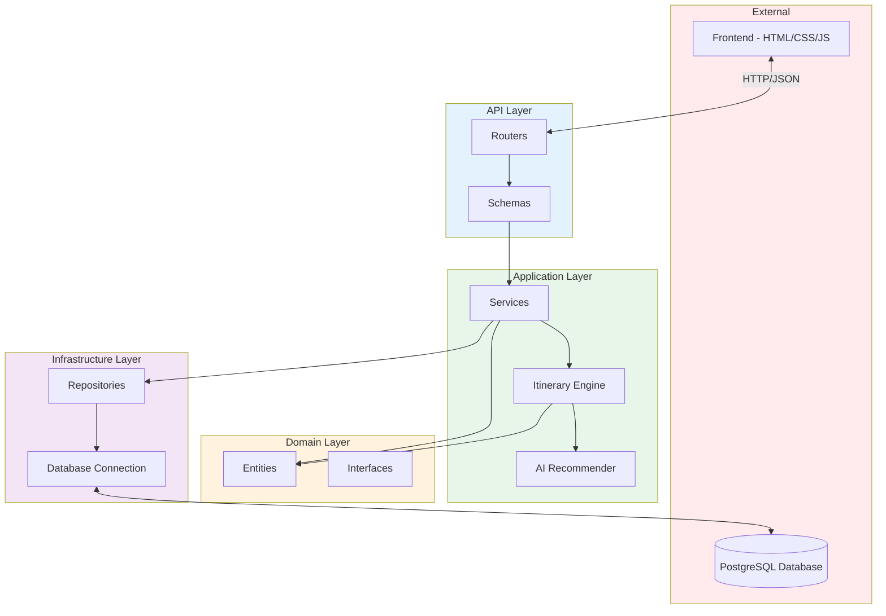

# Class Diagram

## Tổng quan kiến trúc hệ thống

```mermaid
classDiagram
    direction TB

    %% ==================== DOMAIN ENTITIES ====================
    namespace Domain {
        class User {
            +int id
            +str username
            +str email
            +str phone_number
            +str hashed_password
            +Role role
            +bool is_active
            +datetime created_at
            +datetime updated_at
            +int failed_attempts
            +List~str~ tags
        }

        class Role {
            <<enumeration>>
            user
            admin
        }

        class Place {
            +int id
            +str name
            +float priceVND
            +str summary
            +str description
            +str openTime
            +str closeTime
            +str phone
            +float rating
            +int reviewCount
            +int popularity
            +str image_url
            +List~str~ tags
            +Address address
            +to_dict() dict
        }

        class PlaceLite {
            +str category
            +int dwell
            +save() dict
            +from_json() PlaceLite
        }

        class FoodPlace {
            +str cuisine_type
            +str category
            +str menu_url
            +save() dict
            +from_json() FoodPlace
        }

        class Accommodation {
            +str category
            +float price_per_night
            +List~str~ amenities
        }

        class Address {
            +str city
            +str district
            +str ward
            +str street
            +float lat
            +float lng
        }

        class Event {
            +int id
            +str name
            +str description
            +datetime start_date
            +datetime end_date
            +str location
            +str image_url
        }

        class ItinerarySpot {
            +int id
            +str name
            +Literal category
            +float lat
            +float lng
            +int open_time_min
            +int close_time_min
            +float rating
            +int review_count
            +int popularity
            +float price_vnd
            +int dwell_min
            +List~str~ tags
            +str image_url
        }
    }

    %% ==================== API SCHEMAS ====================
    namespace API_Schemas {
        class ItineraryRequest {
            +str city
            +date start_date
            +int num_days
            +int num_people
            +List~str~ tags
            +List~str~ preferred_tags
            +List~str~ avoid_tags
            +float max_leg_distance_km
            +int max_places_per_block
            +List~int~ must_visit_place_ids
            +List~int~ avoid_place_ids
            +BlockTimeConfig morning
            +BlockTimeConfig lunch
            +BlockTimeConfig afternoon
            +BlockTimeConfig dinner
            +BlockTimeConfig evening
        }

        class BlockTimeConfig {
            +bool enabled
            +time start
            +time end
        }

        class DayItineraryResponse {
            +date date
            +Dict blocks
            +CostSummaryResponse cost_summary
        }

        class BlockItemResponse {
            +int place_id
            +str name
            +str type
            +str start
            +str end
            +int dwell_min
            +float price_vnd
            +str image_url
        }

        class CostSummaryResponse {
            +float total_attraction_cost_vnd
            +float total_food_cost_vnd
            +float total_trip_cost_vnd
        }
    }

    %% ==================== APPLICATION LAYER ====================
    namespace Application {
        class TripService {
            +get_trip_itinerary(req) dict
        }

        class TripContext {
            +str city
            +date date
            +int morning_start
            +int morning_end
            +int afternoon_start
            +int afternoon_end
            +int evening_start
            +int evening_end
            +int lunch_start
            +int lunch_end
            +int dinner_start
            +int dinner_end
            +int max_places_per_block
            +float max_leg_distance_km
            +UserPreferences preferences
            +List~int~ must_visit_place_ids
            +List~int~ avoid_place_ids
            +from_request(req) TripContext
        }

        class UserPreferences {
            +List~str~ preferred_tags
            +List~str~ avoid_tags
        }

        class ItineraryEngine {
            +build_trip_itinerary(req, visits, foods) dict
            +build_day_itinerary(context, visits, foods) DayItineraryResponse
            +build_visit_block() List~BlockItem~
            +pick_meal_block() List~BlockItem~
            +sort_spots_diverse() List~ItinerarySpot~
            +calculate_spot_weight() float
        }

        class BlockItem {
            +int place_id
            +str name
            +str type
            +int start_min
            +int end_min
            +int dwell_min
            +float price_vnd
            +str image_url
            +int order
        }

        class HybridRecommender {
            +ContentBasedRecommender cb_recommender
            +float cb_weight
            +fit(interactions)
            +get_recommendations(user_id, tags) List
            +get_content_score(place_id, tags) float
        }

        class ContentBasedRecommender {
            +np.ndarray place_matrix
            +Dict place_id_to_idx
            +Dict tag_to_idx
            +fit(places)
            +get_similar_places(place_id) List
            +get_score(place_id, tags) float
        }

        class UserService {
            +create_user(user_data) User
            +get_user_by_id(id) User
            +update_user(id, data) User
            +delete_user(id) bool
            +authenticate(username, password) User
        }

        class EventService {
            +get_events() List~Event~
            +get_event_by_id(id) Event
            +create_event(data) Event
        }

        class TagService {
            +get_all_tags() List~str~
            +get_tags_by_category(cat) List~str~
        }

        class TripHistoryFileService {
            +save_trip_to_file(user_id, trip_data) bool
            +get_trip_history(user_id) List~dict~
        }
    }

    %% ==================== ADAPTERS / REPOSITORIES ====================
    namespace Adapters {
        class PlacesRepository {
            +fetch_place_lites_by_city(city) List~PlaceLite~
            +fetch_place_by_id(id) PlaceLite
            +search_places(query) List~PlaceLite~
        }

        class FoodRepository {
            +fetch_food_places_by_city(city) List~FoodPlace~
            +fetch_food_by_id(id) FoodPlace
        }

        class AccommodationRepository {
            +fetch_accommodations_by_city(city) List~Accommodation~
        }

        class UserRepository {
            +create_user(user) User
            +get_user_by_id(id) User
            +get_user_by_username(username) User
            +update_user(id, data) User
            +delete_user(id) bool
        }

        class EventRepository {
            +fetch_events() List~Event~
            +fetch_event_by_id(id) Event
        }

        class TagRepository {
            +fetch_all_tags() List~str~
        }
    }

    %% ==================== API ROUTERS ====================
    namespace API_Routers {
        class TripRouter {
            +POST /trip
            +Recommnad_trip(req) Dict
        }

        class AuthRouter {
            +POST /login
            +POST /register
            +POST /logout
        }

        class UserRouter {
            +GET /users/{id}
            +PUT /users/{id}
            +DELETE /users/{id}
            +GET /users/{id}/tags
            +PUT /users/{id}/tags
        }

        class EventRouter {
            +GET /events
            +GET /events/{id}
        }

        class TagRouter {
            +GET /tags
        }

        class VisitorRouter {
            +POST /visitors
            +GET /visitors/count
        }

        class AdminRouter {
            +GET /admin/stats
            +POST /admin/places
        }
    }

    %% ==================== INFRASTRUCTURE ====================
    namespace Infrastructure {
        class Database {
            +connection_pool
            +execute(query) Result
            +fetch_all(query) List
            +fetch_one(query) Row
        }

        class Settings {
            +str DATABASE_URL
            +str IMAGE_BASE_URL
            +int MAX_PLACES_PER_BLOCK_DEFAULT
            +float MAX_LEG_DISTANCE_KM_DEFAULT
        }
    }

    %% ==================== UTILITIES ====================
    namespace Utils {
        class GeoUtils {
            +haversine_km(lat1, lng1, lat2, lng2) float
            +estimate_travel_minutes(dist_km) int
        }

        class TimeUtils {
            +time_to_min(time) int
            +min_to_time_str(minutes) str
            +time_str_to_minutes(time_str) int
        }

        class TagUtils {
            +apply_tag_filter(spots, prefs) List
            +tag_score(spot_tags, pref_tags) float
        }

        class FormatUtils {
            +format_money(amount) str
            +format_time(minutes) str
        }
    }

    %% ==================== RELATIONSHIPS ====================
    
    %% Domain Inheritance
    Place <|-- PlaceLite
    Place <|-- FoodPlace
    Place <|-- Accommodation
    User --> Role

    %% Domain Composition
    Place --> Address
    ItinerarySpot ..> PlaceLite : converts from
    ItinerarySpot ..> FoodPlace : converts from

    %% API Schemas
    ItineraryRequest --> BlockTimeConfig
    DayItineraryResponse --> BlockItemResponse
    DayItineraryResponse --> CostSummaryResponse

    %% Service Dependencies
    TripService --> ItineraryEngine
    TripService --> PlacesRepository
    TripService --> FoodRepository
    TripService --> AccommodationRepository
    
    ItineraryEngine --> TripContext
    ItineraryEngine --> BlockItem
    ItineraryEngine --> HybridRecommender
    ItineraryEngine ..> ItinerarySpot : uses
    
    TripContext --> UserPreferences
    
    HybridRecommender --> ContentBasedRecommender

    UserService --> UserRepository
    EventService --> EventRepository
    TagService --> TagRepository

    %% Router to Service
    TripRouter --> TripService
    TripRouter --> TripHistoryFileService
    AuthRouter --> UserService
    UserRouter --> UserService
    EventRouter --> EventService
    TagRouter --> TagService

    %% Repository to Infrastructure
    PlacesRepository --> Database
    FoodRepository --> Database
    UserRepository --> Database
    EventRepository --> Database

    %% Utils usage
    ItineraryEngine --> GeoUtils
    ItineraryEngine --> TimeUtils
    ItineraryEngine --> TagUtils
```

---

## Cấu trúc thư mục

```
Smart_Travelling/
├── BE/                          # Backend (FastAPI)
│   ├── app/
│   │   ├── api/                 # API Layer
│   │   │   ├── schemas/         # Request/Response schemas
│   │   │   └── v0/router/       # API endpoints
│   │   │
│   │   ├── application/         # Application Layer
│   │   │   ├── ai/              # AI/ML modules
│   │   │   ├── itinerary/       # Trip planning engine
│   │   │   └── services/        # Business services
│   │   │
│   │   ├── domain/              # Domain Layer
│   │   │   └── entities/        # Business entities
│   │   │
│   │   ├── adapters/            # Adapters Layer
│   │   │   └── repositories/    # Data access
│   │   │
│   │   ├── infrastructure/      # Infrastructure Layer
│   │   │   └── database/        # Database connections
│   │   │
│   │   ├── config/              # Configuration
│   │   └── utils/               # Utilities
│   │
│   ├── data/                    # Data storage
│   ├── models/                  # ML models
│   └── tests/                   # Unit tests
│
├── FE/                          # Frontend
│   ├── html/                    # HTML pages
│   ├── css/                     # Stylesheets
│   ├── js/
│   │   ├── api/                 # API calls
│   │   ├── pages/               # Page scripts
│   │   ├── services/            # Frontend services
│   │   └── ui/                  # UI components
│   ├── images/
│   └── icons/
│
└── DB/                          # Database scripts
    ├── 1_addresses.sql
    ├── 2_places.sql
    ├── 3_events.sql
    ├── 4_foodplace.sql
    └── 5_accommodation.sql
```

---

## Kiến trúc Clean Architecture



---

## Ghi chú

### Design Patterns được sử dụng:
- **Repository Pattern**: Tách biệt logic truy cập dữ liệu
- **Service Layer**: Xử lý business logic
- **Factory Pattern**: Tạo ItinerarySpot từ các entity khác
- **Strategy Pattern**: Các thuật toán scoring có thể thay đổi

### Principles:
- **Single Responsibility**: Mỗi class có một nhiệm vụ duy nhất
- **Dependency Inversion**: High-level modules không phụ thuộc vào low-level
- **Open/Closed**: Có thể mở rộng AI recommender mà không sửa engine
