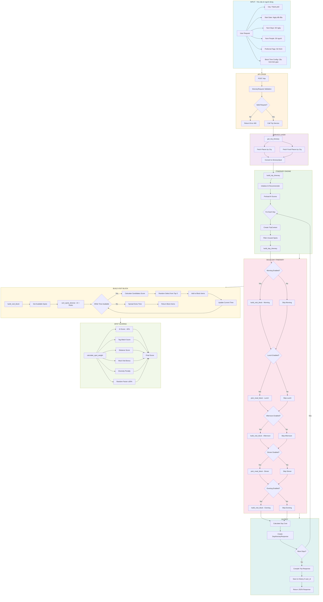
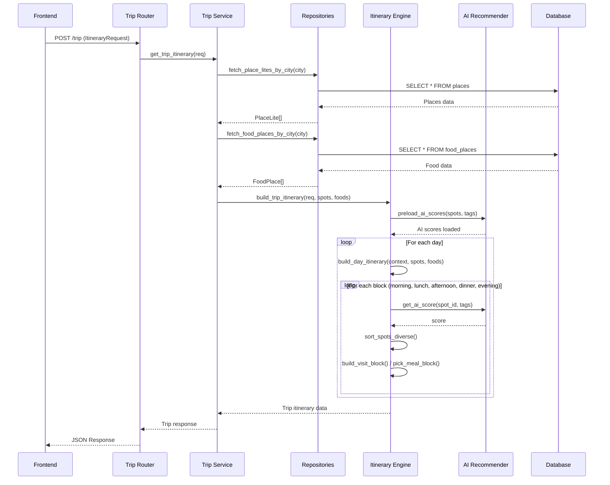

# Trip Itinerary Generation - Flowchart

## Tổng quan quy trình tạo lịch trình du lịch



---

## Chi tiết các bước chính

### Nhận Request từ Frontend
```
ItineraryRequest {
    city: "Hồ Chí Minh"
    start_date: "2025-12-20"
    num_days: 3
    num_people: 2
    preferred_tags: ["history", "food", "culture"]
    morning: {enabled: true, start: "08:00", end: "11:30"}
    lunch: {enabled: true, start: "11:30", end: "13:00"}
    afternoon: {enabled: true, start: "13:30", end: "17:30"}
    dinner: {enabled: true, start: "18:00", end: "19:30"}
    evening: {enabled: true, start: "20:00", end: "22:00"}
}
```

### Lấy dữ liệu địa điểm
- **Places**: Địa điểm tham quan (museum, park, landmark...)
- **Food Places**: Quán ăn, nhà hàng
- Convert sang `ItinerarySpot` với thông tin: lat/lng, giờ mở cửa, rating, tags...

### AI-Powered Scoring
```
Score = (AI_Score × 0.3) + Tag_Match + Distance_Bonus - Diversity_Penalty + Random_Factor
```

### Build từng Block trong ngày
- **Morning**: 2-3 địa điểm tham quan
- **Lunch**: 1 quán ăn gần vị trí cuối morning
- **Afternoon**: 2-3 địa điểm tham quan  
- **Dinner**: 1 quán ăn gần vị trí cuối afternoon
- **Evening**: 1 địa điểm giải trí/cafe

### Output Response
```json
{
    "city": "Hồ Chí Minh",
    "start_date": "2025-12-20",
    "num_days": 3,
    "days": [
        {
            "date": "2025-12-20",
            "blocks": {
                "morning": [...],
                "lunch": [...],
                "afternoon": [...],
                "dinner": [...],
                "evening": [...]
            },
            "cost_summary": {
                "total_attraction_cost_vnd": 150000,
                "total_food_cost_vnd": 300000
            }
        }
    ]
}
```

---

## Sequence Diagram - Tương tác giữa các thành phần



---

## Ghi chú
- **Diversity**: Hệ thống tránh chọn các địa điểm quá gần nhau hoặc cùng loại
- **Time Optimization**: Tự động điều chỉnh thời gian dwell để lấp đầy block
- **Distance Constraint**: Khoảng cách tối đa giữa 2 địa điểm liên tiếp: 5km
- **AI Integration**: Sử dụng Content-Based Filtering để đề xuất địa điểm phù hợp với sở thích
